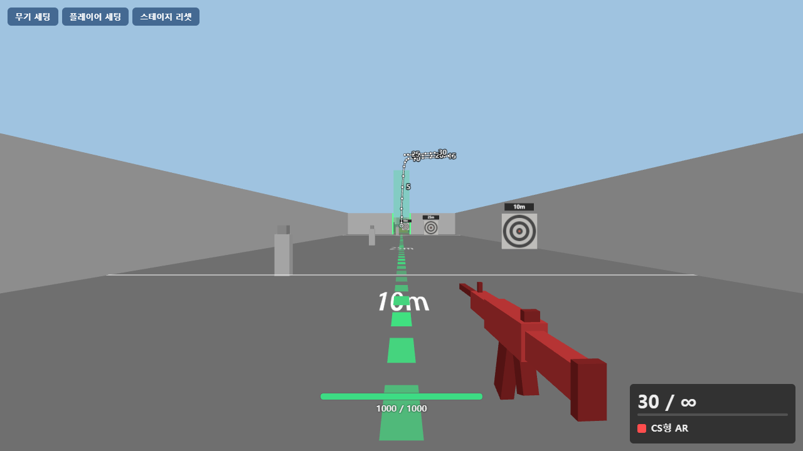
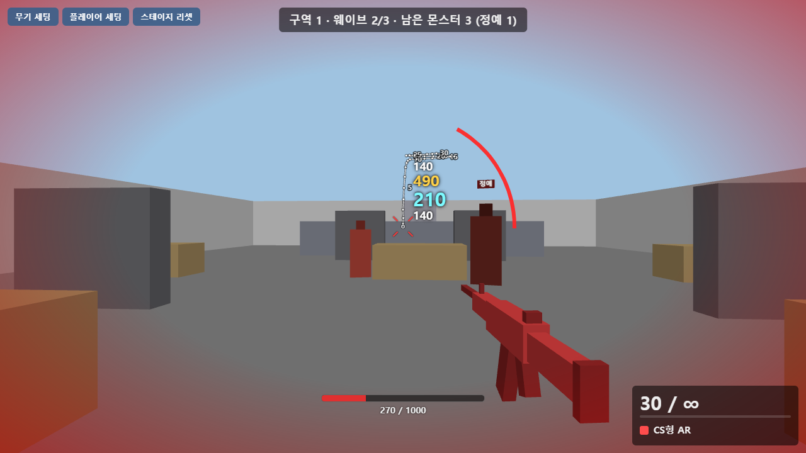
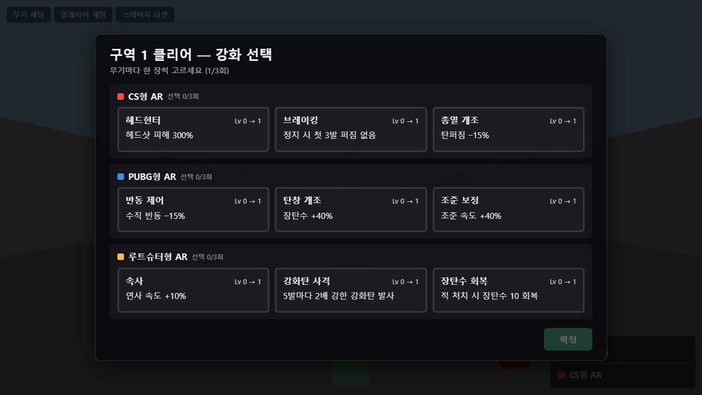
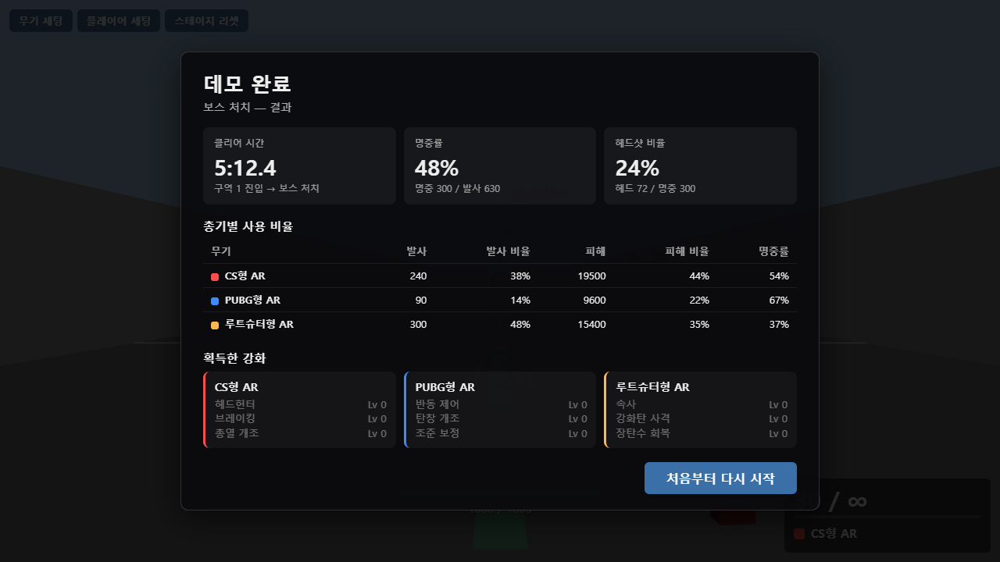

# 루트슈터 데모 — 반동 룰만으로 다른 총 만들기

**같은 AR 클래스라도 반동·퍼짐·복귀·ADS 룰만으로 완전히 다른 총이 된다** — 이것을 3D 사격장에서 직접 쏴 보며 확인하는 1인칭 그레이박스 데모입니다.
루트슈터 회사 지원용 포트폴리오로, 플레이 시간은 10~15분입니다.

## ▶ 바로 플레이

**https://ieparei-stack.github.io/lootshooter-portfolio/**

- 설치·로그인 없이 브라우저에서 바로 실행됩니다 (데스크톱 Chrome / Edge 권장 — 마우스 포인터 잠금이 필요합니다).
- 런타임에 외부 네트워크를 전혀 호출하지 않습니다.

### 내려받아 실행

1. 이 저장소를 **Code → Download ZIP**으로 받아 압축을 풉니다 (또는 `git clone`).
2. **`게임실행.html`을 더블클릭**합니다. 인터넷이 끊겨 있어도 실행됩니다.

> `index.html`은 개발용 진입점이라 더블클릭하면 안내 문구만 보입니다. 반드시 `게임실행.html`을 여세요.

## 조작키

| 입력 | 동작 |
|---|---|
| 마우스 | 시점 · **좌클릭** 사격(풀오토) · **우클릭 유지** 정조준 · **휠** 무기 전환 |
| W A S D | 이동 |
| Shift | 질주 (앞으로만, 사격하면 풀림) |
| C | 웅크리기 토글 |
| R | 재장전 (빈 탄창에서 사격하면 자동) |
| 1 / 2 / 3 | CS형 AR / PUBG형 AR / 루트슈터형 AR |
| Tab | 일시정지 메뉴 (무기 세팅 · 플레이어 세팅) |
| X · P | 탄착군 지우기 · 이론 궤적 표시 토글 |
| M | 현재 구역 리셋 |

## 데모 흐름 (10~15분)

1. **사격장** — 5 / 10 / 20 m 인간형 표적과 과녁판. 세 정을 번갈아 쏘며 탄착군(무기별 색 자국)과 이론 궤적을 비교합니다. 무기 세팅 패널(Tab)에서 반동·퍼짐·복귀·ADS 값을 슬라이더로 바꿔 보면 감각이 어떻게 달라지는지 즉시 확인할 수 있습니다.
2. **구역 1 → 2 → 3** — 근접형·원거리형 몬스터가 3웨이브로 나옵니다. 구역을 클리어할 때마다 세 무기 각각 강화 카드를 한 장씩 고릅니다 (무기당 3장, Lv 0→3).
3. **보스** — 원거리 보스와 소환 근접형. 처치하면 **결과 화면**(클리어 시간 · 명중률 · 헤드샷 비율 · 총기별 사용 비율 · 획득 강화)이 나옵니다.

### 세 정의 성격

| 총 | 정체성 | 룰의 핵심 |
|---|---|---|
| **CS형 AR** | 궤적을 외워 반대로 긋는 **학습형** | 30발 고정 배열(T자형, 지터 0.05°) · 정조준 없음 · 걸으면 퍼짐 ×20이라 멈춰서 쏜다 · 헤드샷 ×2.0 |
| **PUBG형 AR** | 반동을 손으로 버티는 **거리별 행동 분화형** | 수직 누적(한 탄창 34°) + 수평 무작위 · **복귀 없음** · 지향 퍼짐이 커서 정조준 필수 · 앉으면 반동·퍼짐 감소 |
| **루트슈터형 AR** | 게임이 반동을 대신 잡아주는 **복귀 정체성형** | 반동 작고 손을 떼면 0.1 s 안에 복귀 · 대신 13발쯤부터 퍼짐이 2.4°로 자라 **끊어 쏘는 리듬**을 요구 |

값은 전부 [`data/weapons.json`](data/weapons.json) 한 파일에 있고, 게임이 이 파일을 그대로 읽습니다.

## 스크린샷

| 사격장 — 탄착군과 이론 궤적 | 구역 전투 — 정예 몬스터·데미지 숫자 |
|---|---|
|  |  |

| 구역 클리어 — 강화 카드 선택 | 보스 처치 — 결과 화면 |
|---|---|
|  |  |

## 문서

- [총기 감각 구성요소 분해](docs/총기%20감각%20구성요소%20분해.md) — 반동 / 퍼짐 / 복귀 / ADS 네 축이 감각의 어떤 질문을 담당하고, 코드에서 어떻게 쓰이는지
- [총기별 세팅 비교표](docs/총기별%20세팅%20비교표.md) — 3정의 실제 값(표 A = `weapons.json`)과 그 값이 만드는 계산 결과(표 B)
- [신규 총기 기획 절차](docs/신규%20총기%20기획%20절차.md) — 새 총 한 정을 이 데모에 추가할 때 무엇을 어떤 순서로 정하는가
- [총기 시뮬레이터](docs/총기%20시뮬레이터.html) — 무기 값의 원본이 된 2D 반동 룰 시뮬레이터 (내려받아 열기)

## 기술 구성

- **Three.js** (npm, 버전 고정) + **Vite**, JavaScript ESM. 외부 서비스·서버 없음.
- `npm run build` → 모든 스크립트·발사음(WAV, base64)을 인라인한 **HTML 파일 하나**(`게임실행.html`)를 만듭니다.
- 반동 룰은 2D 시뮬레이터의 값과 단위를 그대로 이식했습니다: 누적 수직 반동 상한(`cap`), 패턴 인덱스 순환, 사격 중 bloom 감쇠 ×0.25, 원형 균등 탄착 분포, 보정분을 제외한 복귀(`recovery`).
- 발사음은 프리 라이선스 음원을 가공해 사용했습니다.

### 개발 실행

```bash
npm install
npm run dev     # 브라우저에서 표시된 주소 열기
npm run build   # 루트 게임실행.html 생성
```
